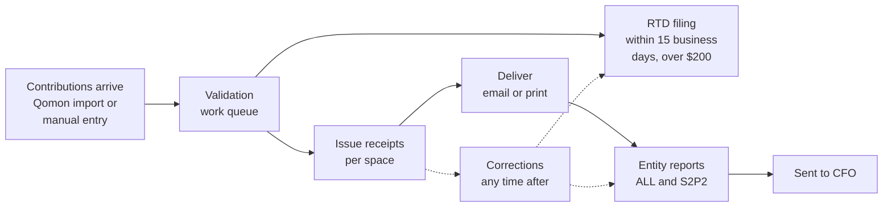

# Tax Receipts & Contributions tool: user guide

The Tax Receipts & Contributions tool is the Green Party of Ontario's staff
system for the whole Elections Ontario (EO) contribution lifecycle: getting
contributions in, checking them against EO's rules, issuing and delivering
tax receipts, fixing mistakes after the fact, and reporting to EO. Every
change anyone makes is recorded with who made it and why.

This guide describes what the tool does and how to use it, area by area. It
is written for the people who use the tool day to day, and is meant to grow
into the tool's help pages. For how the code is laid out and how to run it,
see [`../architecture.md`](../architecture.md).

## Start here

- [Why this tool exists](why.md): the problem it solves and the promises it
  keeps.
- [Key concepts](concepts.md): payments, contributions, entities, periods,
  spaces, receipts, and the other terms the rest of this guide uses. Read
  this first if any screen is confusing.
- [The year at a glance](#the-year-at-a-glance), below: how the areas fit
  together over a receipt cycle.

## Areas of the tool

| Area | Where in the tool | What it is for |
|---|---|---|
| [Accounts, roles, and access](accounts-and-access.md) | Sign-in page, account menu, Admin > Users and Roles | Signing in, managing your own account, and who is allowed to do what. |
| [Space dashboard](dashboard.md) | Home page (`/`) | One row per space (period, riding, entity), with its contribution count, open flags, and stage. The jumping-off point for issuing receipts and generating reports. |
| [Contributions and payments](contributions-and-payments.md) | Contributions | Finding, filtering, and editing contributions; recording cheques, cash, and other payments by hand; importing from Qomon. |
| [Contributors](contributors.md) | Contributors | Adding and editing the people who give, and seeing everything they have given. |
| [Work queue](work-queue.md) | Work queue | Every problem the tool has found that needs a human: rule violations, unexpected changes, amounts owed to EO, sync problems, and bounced email. |
| [Issuing receipts](issuing-receipts.md) | Dashboard > Issue, or a contribution's detail page | Turning clean contributions into numbered tax receipts with PDFs, one space at a time or one contribution at a time. |
| [Delivering receipts](delivering-receipts.md) | The Deliver step of the issuance wizard; Admin > Emails | Emailing receipts, printing and mailing the rest, confirming donor addresses ahead of time, and handling bounces. |
| [Corrections](corrections.md) | A contribution's detail page | Fixing a contribution or receipt after it has been receipted or reported, with the cancellations, replacements, and EO paperwork generated for you. |
| [RTD filings](rtd-filings.md) | RTD filings | Real-time disclosure to EO of contributors over $200, on the 15-business-day clock. |
| [Entity reports](entity-reports.md) | Dashboard > Reports | The annual ALL and S2P2 files per entity, and knowing when one has gone stale. |
| [Change log](change-log.md) | Admin > Change log | The audit trail: every change, who made it, why, and what it looked like before and after. Exportable for EO. |
| [Administration](administration.md) | Admin | Periods, contribution limits, holidays, ridings, leadership contestants, users, roles, the kill switch, receipt layout, and email settings. |
| [Current limitations](limitations.md) | | What the tool does not do yet, and the workaround for each. |

## What can I do with it?

Common tasks, and where each is covered.

**Getting contributions in**

- Record a cheque, cash, or e-transfer that arrived at the office:
  [Recording a payment](contributions-and-payments.md#recording-a-payment-by-hand).
- Split one cheque between the party and a riding association:
  [Splitting a payment](contributions-and-payments.md#splitting-a-payment-across-contributions).
- Pull in new online donations from Qomon:
  [Importing from Qomon](contributions-and-payments.md#importing-from-qomon).
- Add a new donor, or fix a donor's address:
  [Contributors](contributors.md).

**Keeping the data clean**

- See everything that needs attention:
  [Work queue](work-queue.md).
- Change the period or riding on a batch of contributions at once:
  [Bulk edit](contributions-and-payments.md#bulk-editing).
- Accept a flagged contribution as correct anyway:
  [Exceptions](work-queue.md#resolving-an-item).

**Receipting**

- Issue every receipt for a space (for example, all 2026 party
  donations): [The issuance wizard](issuing-receipts.md#issuing-a-whole-space).
- Issue one receipt on its own, for example when a donor asks:
  [Issuing one receipt](issuing-receipts.md#issuing-one-receipt).
- Ask donors to confirm their address and delivery preference before
  receipts go out: [Donor pre-check](delivering-receipts.md#donor-pre-check).
- Send receipts by email and print the rest:
  [Delivering receipts](delivering-receipts.md).
- Deal with a bounced receipt email:
  [Bounces](delivering-receipts.md#when-an-email-bounces).

**Fixing mistakes**

- A donor's name is misspelled on a receipt:
  [Spelling fix](corrections.md#receipt-actions).
- A donor lost their receipt: [Lost copy](corrections.md#receipt-actions).
- The wrong person was receipted, or the amount was wrong:
  [Contribution corrections](corrections.md#contribution-corrections).
- A donor is over the contribution limit:
  [Reallocate](corrections.md#contribution-corrections).
- Two contact records are the same person:
  [Merge](corrections.md#contribution-corrections).

**Reporting to EO**

- File a real-time disclosure (RTD): [RTD filings](rtd-filings.md).
- Produce a riding association's annual ALL and S2P2 files:
  [Entity reports](entity-reports.md).
- Find out which reports changed since they were sent:
  [Dirty reports](entity-reports.md#dirty-reports).
- Show EO who changed what, and why:
  [Change log](change-log.md).

**Running the system**

- Add a user, or give someone a different role:
  [Users and roles](accounts-and-access.md#roles-and-permissions).
- Stop all receipt issuance immediately, for example at EO's request:
  [Kill switch](administration.md#kill-switch).
- Set up next year's periods and contribution limits:
  [Annual settings](administration.md#annual-settings).

## The year at a glance

A receipt cycle moves each space up a ladder, from contributions arriving
to the entity report reaching the riding's CFO. The tool tracks where each
space is on the [space dashboard](dashboard.md).

Throughout the year, contributions arrive and are validated as they land,
so problems surface the day they appear rather than at year end. RTD runs on
its own clock alongside everything else. Receipting, delivery, and the
annual reports happen once the year (or an election period) closes.
Corrections can happen at any point, and the tool works out what each one
means for receipts already issued and filings already sent.
